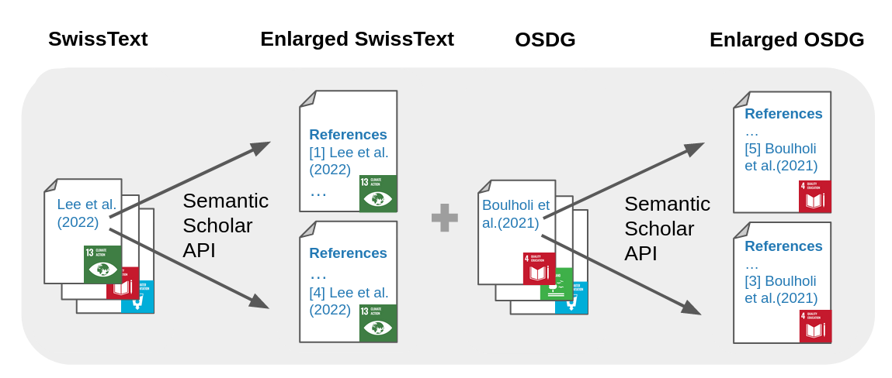

# Additional Data for the SwissText Shared Task 2024 - Classifying SDG

## Process Description

Our hypothesis was that additional labeled data could be retrieved via citations. For each original record in the dataset provided by the shared task and the OSDG dataset, we gathered all of its citations and generated new records by concatenating their titles and abstracts. Each new record was then assigned the same label as the work it referenced, without any manual supervision.



To retrieve the citations, we used the [Semantic Scholar Api](https://api.semanticscholar.org/api-docs/graph#tag/Paper-Data/operation/get_graph_get_paper_citations). The following API call was used, with the DOI or Semantic Scholar PaperId of the original record being inserted in place of `{doi}`:

```
https://api.semanticscholar.org/graph/v1/paper/{doi}/citations?fields=contextsWithIntent,isInfluential,title,abstract
```

**Please note**: The labels assigned to the citations are based on the labels of the original records, without any manual supervision. Hence, they should be seen as *weak labels* and treated with caution. Also, the additional records are *not synthetic*, but are the actual title and abstract of the cited works.


## File Description
There are two files in this folder:
- `citing_works_swisstext.csv`: Contains the additional records generated retrieving the citations of the SwissText dataset.
- `citing_works_OSDG.csv`: Contains the additional records generated retrieving the citations of the OSDG dataset.

Both files have the following columns:
- `paperID`: The identifier for a record in the Semantic Scholar database.
- `text`: The concatenation of the title and abstract of the cited work.
- `sdg`: The label of the original work were the citation was retrieved from.

Additionally, the `citing_works_osdg.csv` file contains the following column:
- `label`: The inter-annotator agreement score of the label of the original work. S. OSDG dataset for more information.

